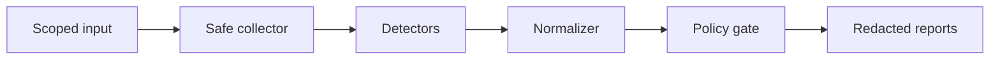

# Architecture

Secret Sentinel separates collection, detection, policy, and presentation so that a finding can be tested without coupling it to a filesystem or CI platform.

## Components

### Scoped collector

The collector accepts an explicit root and applies include/exclude rules, file-size limits, symlink policy, and binary-file handling. It must never follow an unbounded path or read outside the requested scope.

### Detector registry

Detectors are small, deterministic functions. Each detector returns a detector ID, category, match location, confidence, severity, and a safe remediation hint. Detector implementations receive bounded text and must not emit the matched value.

### Normalizer and redactor

The normalizer deduplicates overlapping matches and produces a stable finding schema. Redaction happens before serialization, logging, test failure output, or exception rendering. Raw match values are not part of the public domain model.

### Policy gate

Policy maps findings to an exit status. It is fail-closed for invalid policy, unsupported versions, and unsafe overrides. Suppressions should be narrow, documented, and reviewable.

`ScanReport.complete` records whether selected input was fully processed. Read/traversal failures and resource truncation set it to false and append a safe warning. CLI policy gives incomplete input exit `2` before considering finding severity. Each file has its own finding budget, so truncating one file cannot consume another file's budget.

### Reporters

JSON is for automation; Markdown is for human review. Both use the same redacted finding model so they cannot diverge on secret handling.

## Trust boundaries

The repository being scanned is untrusted input. File names, encodings, symlinks, archive members, and detector input can be adversarial. CI logs and report artifacts are also treated as sensitive outputs.

## Design invariants

- no network access is required for a scan;
- no provider validation or credential use;
- no repository mutation;
- deterministic findings for identical input, policy, and version;
- raw secrets are never included in reports or telemetry.
